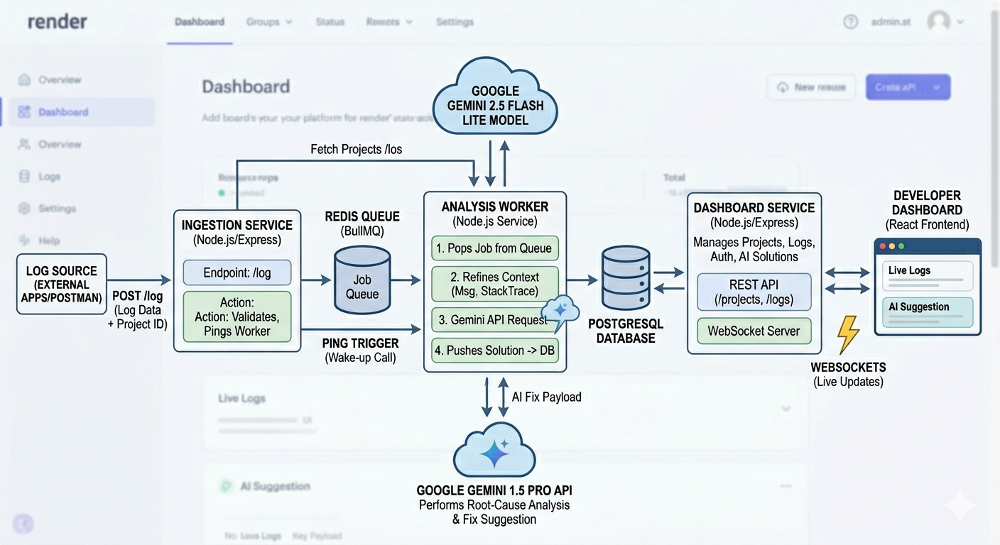

# OmniLog AI

Real-Time Microservices Error Analysis Engine
OmniLog AI is a distributed system designed to solve the "MTTR" (Mean Time To Resolution) gap. It ingests raw backend logs, processes them through an asynchronous pipeline, and leverages Gemini 2.5 Flash Lite to provide instant, actionable code fixes.

# System Architecture
This project is built as a Microservices Monorepo, demonstrating proficiency in distributed systems and service orchestration.

## Ingestion Service: 
A high-speed entry point that validates incoming logs and offloads them to the queue.

## Redis Queue (BullMQ): 
Acts as the system’s "waiting room," ensuring reliability and handling traffic spikes without losing data.

## Analysis Worker: 
A specialized service that fetches jobs from Redis, interacts with the Gemini AI API, and pushes solutions to the database.

## Dashboard & Frontend: 
A React-based interface with a dedicated backend for managing user projects and live log updates.

# Tech Stack
•	Languages: Node.js, JavaScript
•	Backend: Express, Redis (BullMQ)
•	Database: PostgreSQL
•	Frontend: React (Vite), Tailwind CSS
•	AI: Google Gemini 2.5 Flash Lite
•	Hosting: Render

# How to test : When you signin right click then go to inspect then console and see joined room variable. Copy that id , open postman and send a test error as such
{
  "userId": "the copied id",
  "message": "Connection terminated unexpectedly due to password authentication failed for user 'postgres'",
  "stackTrace": "at Client._handleError (/app/node_modules/pg/lib/client.js:355:19)\n at Connection.emit (node:events:517:28)\n at /app/node_modules/pg/lib/connection.js:156:24",
  "projectId": "Project-1"
}

After that check dashboard.
Why is it difficult to get the id??
I forgot to add a profile section and delete id option. Will add later. Sorry for the inconvenience, will add asap.

